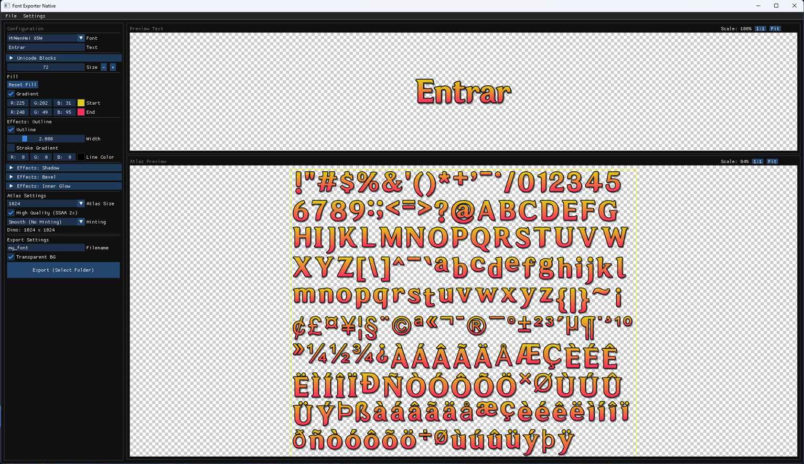

# Fnt Generator

A cross-platform (Windows, macOS, Linux) tool for generating bitmap font atlases. Project created out of personal necessity to generate bitmap fonts for use with the **Starling Framework** and **FeathersUI**. It exports industry-standard `.fnt` (XML) and `.png` files compatible with these engines and others that support the BMFont format.



## Features

- **Cross-Platform:** Runs on Windows, macOS, and Linux.
- **High Quality:** Uses FreeType with configurable hinting (Smooth, Sharp, Crisp) and Super Sampling Anti-Aliasing (SSAA 2x).
- **Advanced Effects:** 
  - Stroke/Outline (Gradient support)
  - Drop Shadow (Blur support)
  - Inner Glow
  - Bevel/Emboss
  - Gradient Fills
- **Real-Time Preview:** Visualize your atlas and text rendering instantly.
- **Export:** Generates industry-standard `.fnt` (XML) and `.png` atlases compatible with popular game engines (AngelCode BMFont format).
- **Style Persistence:** Save and load your favorite font styles.

## Prerequisites

### Windows
- **Visual Studio 2022** (or newer) with C++ Desktop Development workload.
- **CMake** (3.20+ recommended).
- **Git** (Required to fetch dependencies).

### macOS
- **Xcode Command Line Tools** (`xcode-select --install`).
- **CMake** (`brew install cmake`).
- **Ninja** (optional, recommended: `brew install ninja`).
- **Git** (Usually included in Xcode tools, check with `git --version`).
- **Libraries**:
  - `glfw`, `freetype` (Install via Homebrew: `brew install glfw freetype`).

### Linux (Ubuntu/Debian)
- **GCC/G++** and build tools.
- **CMake**.
- **Libraries**:
  - `libglfw3-dev`, `libfreetype6-dev`, `libgtk-3-dev`.

## Building the Project

### Windows
1. Open the project folder in **Visual Studio** or use the provided script.
2. Run `build_windows.bat` in the root directory.
   - This script will configure CMake, build the project in Release mode, and place the executable in `build/Release`.
3. The executable will be available at `build\Release\FontExporter.exe`.

### macOS
1. Ensure dependencies are installed:
   ```sh
   brew install cmake glfw freetype
   ```
2. Run the build script:
   ```sh
   chmod +x build_macos.sh
   ./build_macos.sh
   ```
3. This creates a `.app` bundle at `build/FontExporter.app`. You can run it directly or move it to Applications.

### Linux
1. Install dependencies:
   ```sh
   sudo apt-get update
   sudo apt-get install cmake g++ libglfw3-dev libfreetype6-dev libgtk-3-dev
   ```
2. Run the build script:
   ```sh
   chmod +x build_linux.sh
   ./build_linux.sh
   ```
3. Run the executable:
   ```sh
   ./build/FontExporter
   ```

## Usage Guide

1. **Load Font:** Click the folder icon to select a `.ttf` or `.otf` font file from your system.
2. **Adjust Size:** Set the font size and padding.
3. **Apply Effects:** Enable Stroke, Shadow, etc., and tweak parameters in real-time.
4. **Hinting:** Choose "Smooth (No Hinting)" for best results in games/textures.
5. **Export:** Click "Export", choose a destination folder, and the tool will generate the `.fnt` and `.png` files.

## Project Structure

- `src/`: Source code.
  - `main.cpp`: Application entry point and UI logic (ImGui).
  - `Atlas/`: Texture generation logic (`TextureGenerator`).
  - `Font/`: FreeType wrapper (`FontManager`).
  - `Utils/`: Helpers for platform dialogs, bitmap operations (`BitmapUtils`), and exporting (`Exporter`).
- `build_*.sh/bat`: Platform-specific build scripts.
- `CMakeLists.txt`: CMake build configuration.

## Acknowledgments & Libraries Used

This project relies on these amazing open-source libraries:

- **[FreeType](https://freetype.org/)**: Robust font rendering engine.
- **[Dear ImGui](https://github.com/ocornut/imgui)**: Bloat-free Immediate Mode GUI for C++.
- **[GLFW](https://www.glfw.org/)**: Open Source, multi-platform library for OpenGL, OpenGL ES, Vulkan, window and input.
- **[nlohmann/json](https://github.com/nlohmann/json)**: JSON for Modern C++.
- **[stb_image_write](https://github.com/nothings/stb)**: Single-file public domain image writer.


---

**Note:** AI was utilized in the development of this project.
